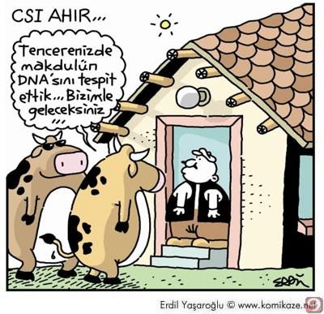
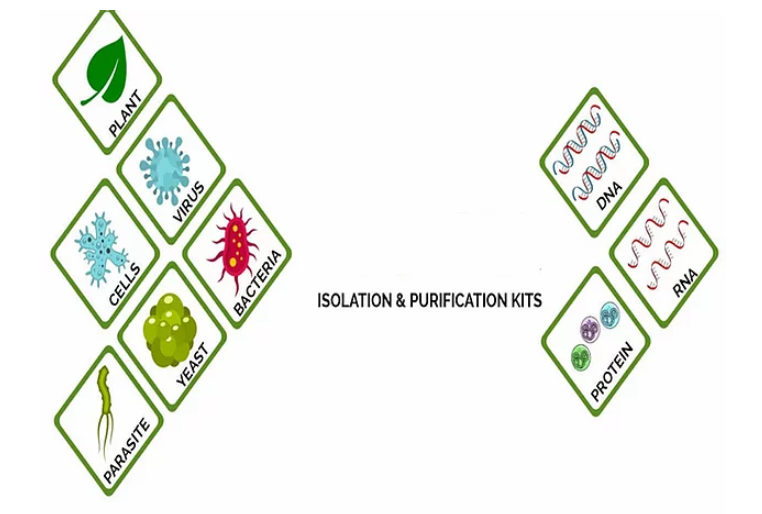
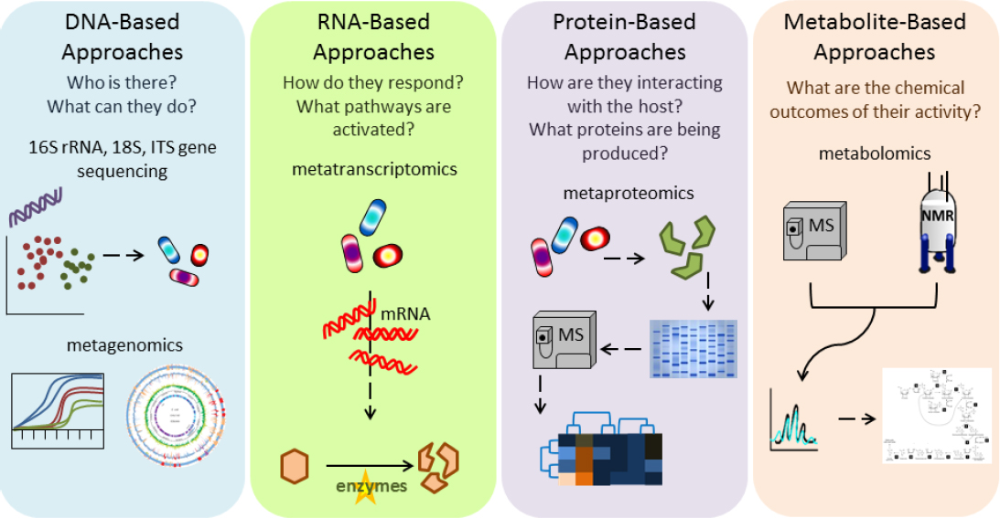
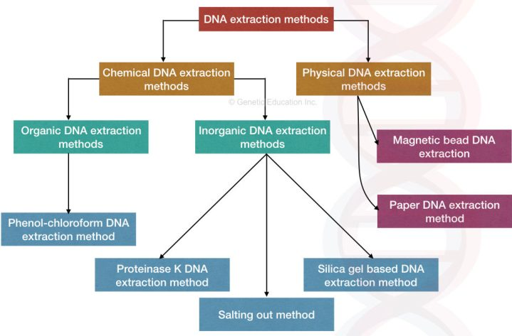
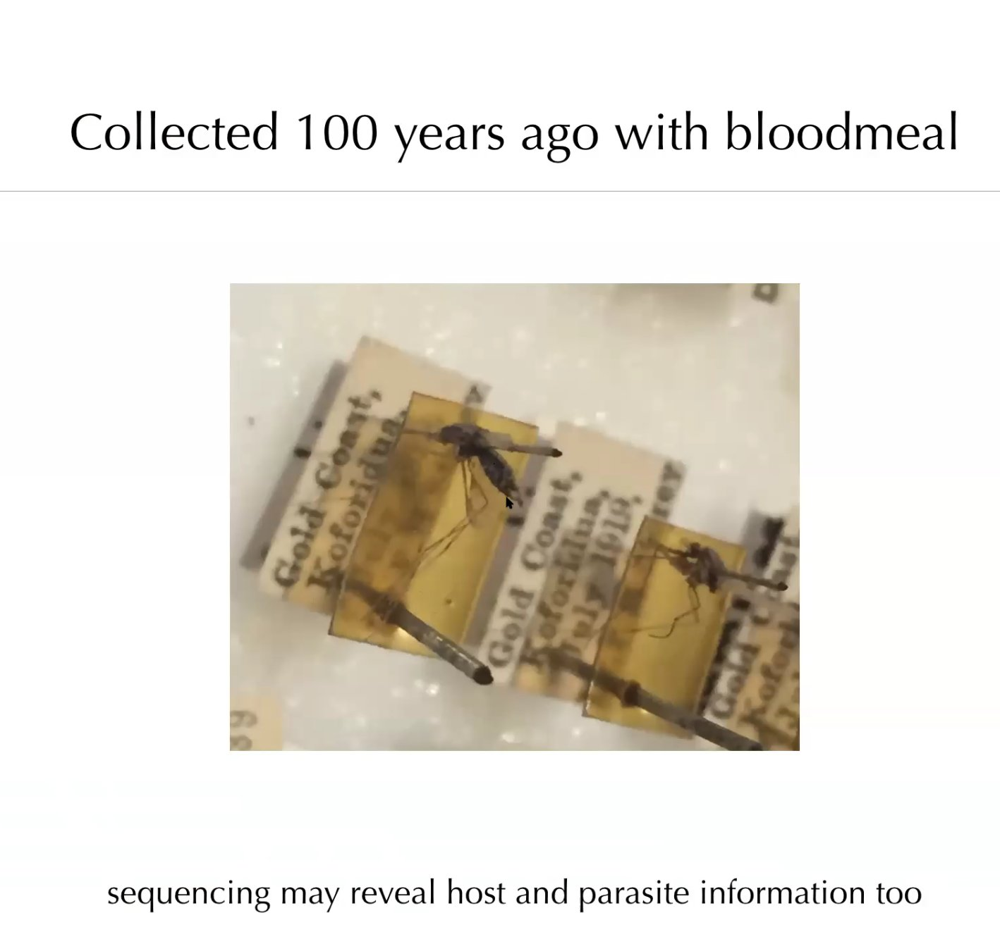
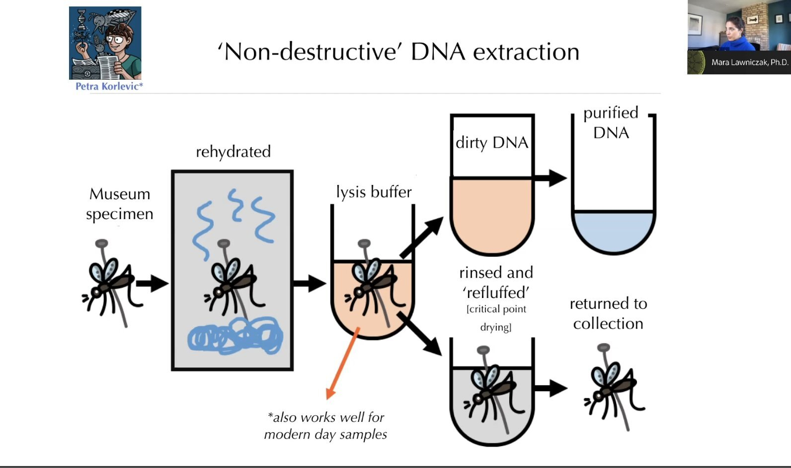
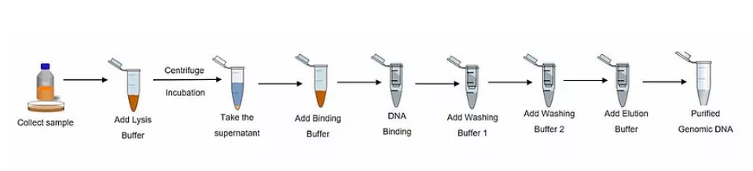
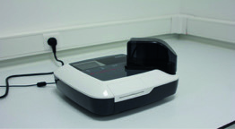

```{r setup, include=FALSE}
options(htmltools.dir.version = FALSE)
knitr::opts_chunk$set(
  fig.width=9, fig.height=3.5, fig.retina=3,
  out.width = "100%",
  cache = FALSE,
  echo = TRUE,
  message = FALSE, 
  warning = FALSE,
  hiline = TRUE,
  fig.showtext = TRUE
)
```

```{r xaringan-themer, include=FALSE, warning=FALSE}
library(xaringanthemer)
style_duo_accent(
  primary_color = "#3c724a",
  secondary_color = "#8ba08b",
  inverse_header_color = "#8ba08b",
  background_image = "img/AGENTEM-slide_background-16_9-1210_681.png",
  colors = c(
  lightgray = "#edf2ee",
  darkgray = "#8ba08b",
  green1 = "#3c724a",
  green2 = "#60a670",
  green3 = "#6ea780",
  green4 = "#99d1a6",
  black = "#2f332e",
  purple1 = "#b4949c",
  purple2 = "#aaafad",
  red = "#ff0000",
  white = "#FFFFFF"
)
)
```

```{r xaringan-tile-view, echo=FALSE}
xaringanExtra::use_tile_view()
```

```{r xaringan-editable, echo=FALSE}
xaringanExtra::use_editable(expires = 1)
```

```{r share-again, echo=FALSE}
xaringanExtra::use_share_again()
```

```{r xaringan-scribble, echo=FALSE}
xaringanExtra::use_scribble()
```

```{r xaringanExtra-search, echo=FALSE}
xaringanExtra::use_search(show_icon = TRUE)
```

```{r xaringan-fit-screen, echo=FALSE}
xaringanExtra::use_fit_screen()
```

background-image: url(img/AGENTEM-slide_title_background-16_9-1210_681.png)
.agentem-title-slide[
.pull-right[
.center[
`r rmarkdown::metadata$title`
`r rmarkdown::metadata$subtitle`
]
]
]

.header-card[
.center[
.can-edit[
Abdullah HANTA<br> 
Ç.Ü. Biyoteknoloji Y.Lisans<br> 
Danışman: Prof.Dr. Sevcan TUĞ BOZDOĞAN<br> 
Ç.Ü. AGENTEM<br>
]
]
]
---
class: center
## Hakkımda

### Abdullah HANTA
### Moleküler Biyolog
##### links:
[`r fontawesome::fa("link")` My Website](https://ahprojects.github.io/)  
[`r fontawesome::fa("github", a11y = "sem")` @ahprojects](https://github.com/ahprojects)

---
# Özet

## - DNA nedir? Temel özellikleri nelerdir?

## - DNA nerede bulunur?

## - DNA izolasyonun aşamaları nelerdir?

## - DNA izolasyonunun çeşitleri nelerdir?
---
## DNA'nın Temel Özellikleri
.pull-left[
### - .black[Adenin, Guanin, Sitozin ve Timinden olusur]
### - .black[Negatif yüklüdür.]
### - .black[Dayanıklı bir yapısı vardır.]
### - .black[Suda çözünür alkolde çözünmez]
### - .black[Her türlü hücreden izole edilebilir.]
]

.pull-right[
```{r,echo=FALSE,out.width="45%",fig.cap='<a href="https://cutt.ly/TMnIB7C">source:wikimedia.org</a>'}
# url
knitr::include_graphics("https://cutt.ly/TMnIB7C") 
```

```{r, echo=FALSE, out.width= "45%",fig.cap='<a href="https://cutt.ly/kMnO4SG">source: bilimgenc.tubitak.gov.tr</a>'}
# local
knitr::include_graphics("https://cutt.ly/kMnO4SG")
```
]

---
## DNA nerede bulunur?
.pull-left[
### .black[Nükleus]
### .black[Mitokondri]
### .black[Kloroplast]
]
.pull-right[
```{r, echo=FALSE}
# local

```
]
---
# .center[İzolasyon Aşamaları]
.pull-left[
### .green2[Lizis:] .black[Hücrelerin Parçalanması <br> (Fiziksel ya da Kimyasal)]

### .green2[Pürifikasyon:] .black[DNA-Protein kompleksinin çözünmesi]

### .green2[Presipitasyon :] .black[DNA’nın ortamdaki diğer moleküllerden uzaklaştırılması]
]

.pull-right[
```{r, echo=FALSE, out.width="110%",fig.cap='<a href="https://cutt.ly/ZMnPRiu">source: molekulerbiyolojivegenetik.org/</a>'}
# local
knitr::include_graphics("https://cutt.ly/ZMnPRiu")
```
]

---
layout: true
# İzolasyon Alanları
---

.center[
```{r, echo=FALSE,out.width="60%",fig.retina=5,fig.cap='<a href="https://cutt.ly/9MnP58S">source: nucleogene.com</a>'}
# local

```
]

---
.center[
```{r, echo=FALSE,out.width="70%",fig.retina=5}
# local

```
]
---
layout: true
# İzolasyon Metodları
---

.center[
```{r, echo=FALSE,out.width="60%",fig.retina=3,fig.cap="source: GeneticEducation Inc."}
# local

```
]
---

.pull-left[
```{r, echo=FALSE,out.width="45%",fig.retina=5,fig.cap='<a href="https://cutt.ly/gMnRoUV">source: www.dabasmuzejs.gov.lv</a>'}
# local
knitr::include_graphics("https://cutt.ly/gMnRoUV")
```

```{r, echo=FALSE,out.width="45%",fig.retina=5,fig.cap='<a href="https://cutt.ly/4MnDrSx">source: https://www.medilabsecure.com/</a>'}
# local
knitr::include_graphics("https://cutt.ly/4MnDrSx")
```
]
.pull-right[
```{r, echo=FALSE,out.width="100%",fig.retina=5}
# local

```
]

---
.center[
```{r, echo=FALSE,out.width="50%",fig.retina=3}
# local

```

Petra Korlević, Erica McAlister, Matthew Mayho, Alex Makunin, Paul Flicek, Mara K N Lawniczak <br> [A Minimally Morphologically Destructive Approach for DNA Retrieval and Whole-Genome Shotgun Sequencing of Pinned Historic Dipteran Vector Species, Genome Biology and Evolution, Volume 13, Issue 10, October 2021, evab226,](https://doi.org/10.1093/gbe/evab226)
]
---
.center[
```{r, echo=FALSE,out.width="45%",fig.retina=3}
# local
knitr::include_graphics("https://cutt.ly/MMnCWLV")
```
]
Wei-Kai Wu, Chieh-Chang Chen, Suraphan Panyod, Rou-An Chen, Ming-Shiang Wu, Lee-Yan Sheen, Shan-Chwen Chang,
[Optimization of fecal sample processing for microbiome study — The journey from bathroom to bench,Journal of the Formosan Medical Association,Volume 118, Issue 2,
2019,Pages 545-555,ISSN 0929-6646](https://doi.org/10.1016/j.jfma.2018.02.005)
---
layout: false
.center[
```{r, echo=FALSE,out.width="50%",fig.retina=3,fig.cap='<a href="https://cutt.ly/mMnNrOQ">source: en.wikipedia.org/wiki/Human_microbiome</a>'}
# local
knitr::include_graphics("https://cutt.ly/mMnNrOQ")
```
]
---
layout: true
# İzolasyon Metodları
---
.pull-right[
```{r, echo=FALSE,out.width="110%",fig.retina=3}
# local
knitr::include_graphics("https://cutt.ly/vMn0rx8")
```
]
.pull-left[
.black[
Takamatsu, Takeshi & Baslam, Marouane & Inomata, Takuya & Kazusato, Oikawa & Itoh, Kimiko & Ohnishi, Takayuki & Kinoshita, Tetsu & Mitsui, Toshiaki. (2018).] <br> [Optimized Method of Extracting Rice Chloroplast DNA for High-Quality Plastome Resequencing and de Novo Assembly. Frontiers in Plant Science. 9.](https://doi.org/10.3389/fpls.2018.00266)

[Scientific Figure 1 ](https://cutt.ly/vMn0rx8)
]
---
layout: false
# DNA izolasyonu aşamaları

```{r, echo=FALSE,out.width="130%",fig.retina=3,fig.cap='<a href="https://cutt.ly/9MnP58S">source: nucleogene.com</a>'}
# local

```
---
layout: true
# Lizis
---
--

## .black[Hücrenin parçalanarak DNA’ya ulaşmamızı sağlayan ilk aşamadır.]  
--

### - Kaotropik Tuzlar
--

### - Deterjanlar
--

### - Enzimler
---

### - .purple1[EDTA’lı Kan :] .black[*Mg* bağlar **DNA**’yı stabilize eder, **Dnase**’ın etkisi engellenir]   
--

### - .purple1[Tris Edta (TE):] .black[**TE** eritrositlerin parçalanmasını sağlar]   
--

### - .purple1[Sodyum Deodosil Sülfat (SDS):] .black[Deterjan türevidir,hücre zarındaki lipidlerin parçalanmasını sağlayarak hücre zarının geçirgenliğini arttırarak hücrenin yapısını bozar.]  
---

### - .purple1[NaCl:] .black[Tuz hücre zarından girerek **DNA**’yı proteinlerden ayırır.]   
--

### - .purple1[Proteinaz K:] .black[Proteinleri parçalayarak homojen bir yapı ortaya çıkarır.]   
--

### - .purple1[Rnase:] .black[**RNA**’ların parçalanarak ortamdan uzaklaşmasını sağlar.]   
---
layout: true
## Pürifikasyon
---

### - .black[Lizatın üzerine 250 μl Fenol 250 μl Kloroform eklenir, karıştırılır. 2500 rpm de 2 dk. Santrifüj edilir.]  
--

### - .black[Üst faz başka tüpe alınır alt faz atılır.]  
--

### - .black[Üst faz ile aynı işlem iki sefer daha tekrarlanır.]  
--

### - .black[Fenol proteinleri degrade ederken, kloroform gradient farkı yaratarak DNA’nın fenol ve parçalanmış atıklarla beraber dibe çökmesini engeller. .fn[1] ]
.footnote[[1]Fenol kloroform proteinlerin uzaklaştırılmasını sağlar.]
---

### - .black[Fenolle proteinler denatüre edilerek ortamdan uzaklaşmaları sağlanır.]
### - .black[Kullanılan fenolün pH’sı önemlidir;]   
###     * .black[alkali pH’ta (pH 8.0) RNA’lar uzaklaştırılırken]     
###     * .black[asidik pH’ta (pH 5.0) DNA’lar uzaklaştırılır]  

---
layout: true
## Presipitasyon
---

### 1. .black[Absolut soğuk alkol ile presipitasyon(çökeltme) yapılır (+santrifüj)]  
### 2. .black[%70’lik *alkol* ile **DNA** yıkanır (proteinler uzaklaştırılır)]  
### 3. .black[**DNA** ***Tris-Edta*** ile çözdürülüp saklanır.]  

### .purple1[A. **DNA**’nın kimyasal olarak çöktürülmesi: ***Etanol***]  
#### .purple1[A.1. Çökelmeyi artırıcı bazı kimyasallar ***İzopropanol***]
### .purple1[B. **DNA**’nın fiziksel olarak çöktürülmesi: ***Santrifüj***]  
---

### .black[Son ***fenol*** muamelesinden sonra farklı tüpe alınan **DNA** içeren üst faza soğuk % 99’luk ***etanol*** eklenir ve **DNA** çöktürülür.]
### .black[Soğuk ***etanol***de **DNA** tüm diğer moleküllerden (degrade olmuş veya olmamış **RNA**, **protein** parçaları, ***fenol*** kalıntısı gibi) daha hızlı çökelir.]

---
layout: true
# Manuel DNA izolasyonu
---

### Uygulama Basamakları 

#### 1. Hazırlanan lizis solüsyonundan hücre peletinin üzerine 2 mL eklenir. 37°C ‘de bir gece bekletilir.  
#### 2. 1 mL doygun ***NaCl*** eklenir. 
#### 3. Örnekler 55°C 10 dakika bekletilir. 
#### 4. 30 dakika 500 g’de santrifüj edilir.   
#### 5. Alttaki **protein** yapidaki bölümüne dokunmadan süpernatant yeni bir tüpe aktarılır.  
#### 6. Süpernatantın 2 katı hacimde soğuk %96’lık ***etanol*** eklenir. Tüp defalarca alt üst edilerek **DNA**’nın çökmesi sağlanır.  

---

#### 7. Çöken **DNA** plastik spatula ya da santrifüj ile alınarak yeni bir tüpe aktarılır. Santrifüj yapılacak ise 10000 g’de 10 dakika santrifüj edilir. Üstteki alkol fazı atılır. 
#### 8. %70’lik alkol ile **DNA** bir kez yıkanır. Bunun için 1 mL %70’lik alkol eklenir. Tüp alt üst edilir. 10000 g’de 10 dakika santrifüj edilir. Üstteki alkol fazı atılır. 
#### 9. **DNA** havada kurutulur.   
#### 10. Distile suda **DNA** çözülür. Çözülmesini kolaylaştırmak için 65C’de 10 dakika tutulur.  
#### 11. Elde edilen **DNA** dan 1/25 -1/40 dilüsyon hazırlanır. A280/A260 oranı ölçülür .fn[1] 

.footnote[[1]-A280/A26 oranının 1.5'den büyük olması DNA saflığının yeterliliğini belirtir.]  

---

### SPEKTROFOTOMETRİ
.pull-left[
- **OD** (optik yoğunluk değeri, absorbans)  
- **OD** ***260/280*** oranı örnek temizliğini gösterir<br>(1.8 ideal oran)  

- ***260nm*** nükleik asitler 
- ***280nm*** proteinler 
- **OD < 1.8** protein .red[kontaminasyonu]  
- **OD > 1.8** nükleik asit .red[kontaminasyonu]  
]

.pull-right[
```{r, echo=FALSE,out.width="110%",fig.retina=3}
# local

```
]

???
Sunum notlari
o
---
layout: true
class: center, middle

# Thanks!
Template created by [Abdullah HANTA](https://ahprojects.github.io/)  

Slides created via the R packages:

[**xaringan**](https://github.com/yihui/xaringan)<br>
[gadenbuie/xaringanthemer](https://github.com/gadenbuie/xaringanthemer)  
[gadenbuie/xaringanExtra](https://github.com/gadenbuie/xaringanExtra)

The chakra comes from [remark.js](https://remarkjs.com), [**knitr**](http://yihui.name/knitr), and [R Markdown](https://rmarkdown.rstudio.com).
---